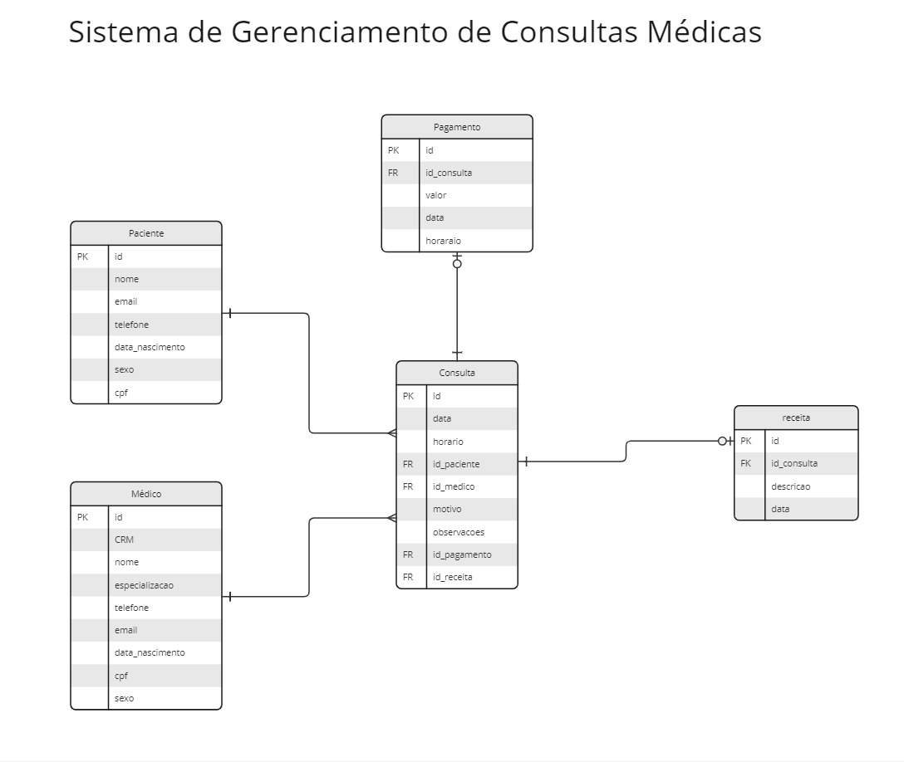

# Trabalho CRUD da disciplina de Programação Orientada a Objetos em Java

**Aluno:** Camila Silva dos Santos

**Matrícula:** 202208699758

**Aluno:** Jeferson Martins

**Matrícula:** 202208980392

Este projeto CRUD foi desenvolvido como parte da disciplina de Programação Orientada a Objetos em Java. Utiliza o framework Spring e o sistema de gerenciamento de dependências Maven, com uma base de dados H2, para servir como uma API REST.

### Paciente
- **Id:**: Identificador único
- **nome**: Nome do Paciente
- **cpf**: Número de CPF do Paciente
- **telefone**: Número de Telefone do Paciente
- **email**: Email de Contato do Paciente
- **dataNascimento**: Data de Nascimento do Paciente
- **sexo**: Sexo do Paciente

### Médico
- **Id:**: Identificador único
- **nome**: Nome do Médico
- **crm**: Número do CRM do Médico
- **especialidade**: Área de especialidade do Médico
- **telefone**: Número de Telefone do Médico
- **email**: Email de contato do Médico
- **dataNascimento**: Data de Nascimento do Médico
- **sexo**: Sexo de Médico
- **cpf**: Número de CPF do médico

### Consulta
- **id**: Identificador Único
- **data**: Data da Consulta
- **horario**: Horário da Consulta
- **valor**: Valor da Consulta
- **motivo**: Motivo da Consulta
- **observacoes**: Observações Médicas

### Receita
- **id**: Identificador Único
- **descricao**: Descrição da Receita
- **data**: Data em que a Receita foi passada
- **horario**: Horario em que a Receita foi passada
- **observacoes**: Observações médicas em relação à receita
- **medicamentos**: Medicamentos que foram passados na receita

### Pagamento
- **id**: Identificador Único
- **valor**: Valor do Pagamento
- **formaDePagamento**: Forma de Pagamento utilizada
- **data**: Data do Pagamento
- **horario**: Horário do Pagamento

## Diagrama entidade relacionamento - DER

## Endpoints

### Paciente
- **GET**:      http://localhost:8090/api/v1/pacientes
- **GET**:      http://localhost:8090/api/v1/pacientes/{id}
- **POST**:     http://localhost:8090/api/v1/pacientes
- **PUT**:      http://localhost:8090/api/v1/pacientes/{id}
- **DELTE**:    http://localhost:8090/api/v1/pacientes/{id}

### Méddico
- **GET**:      http://localhost:8090/api/v1/medicos
- **GET**:      http://localhost:8090/api/v1/medicos/{id}
- **POST**:     http://localhost:8090/api/v1/medicos
- **PUT**:      http://localhost:8090/api/v1/medicos/{id}
- **DELTE**:    http://localhost:8090/api/v1/medicos/{id}

### Consulta
- **GET**:      http://localhost:8090/api/v1/consultas
- **GET**:      http://localhost:8090/api/v1/consultas/{id}
- **POST**:     http://localhost:8090/api/v1/consultas
- **PUT**:      http://localhost:8090/api/v1/consultas/{id}
- **DELTE**:    http://localhost:8090/api/v1/consultas/{id}

### Receita
- **GET**:      http://localhost:8090/api/v1/receitas
- **GET**:      http://localhost:8090/api/v1/receitas/{id}
- **POST**:     http://localhost:8090/api/v1/receitas
- **PUT**:      http://localhost:8090/api/v1/receitas/{id}
- **DELTE**:    http://localhost:8090/api/v1/receitas/{id}

### Pagamento
- **GET**:      http://localhost:8090/api/v1/pagamentos
- **GET**:      http://localhost:8090/api/v1/pagamentos/{id}
- **POST**:     http://localhost:8090/api/v1/pagamentos
- **PUT**:      http://localhost:8090/api/v1/pagamentos/{id}
- **DELTE**:    http://localhost:8090/api/v1/pagamentos/{id}